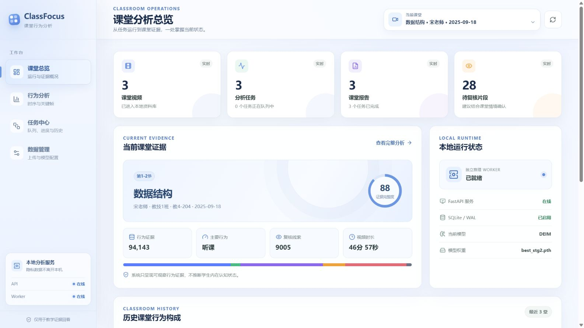
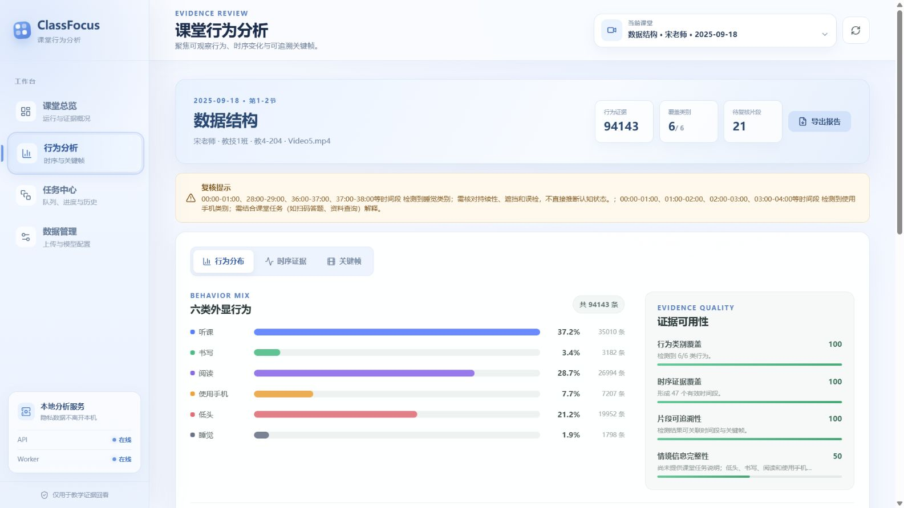
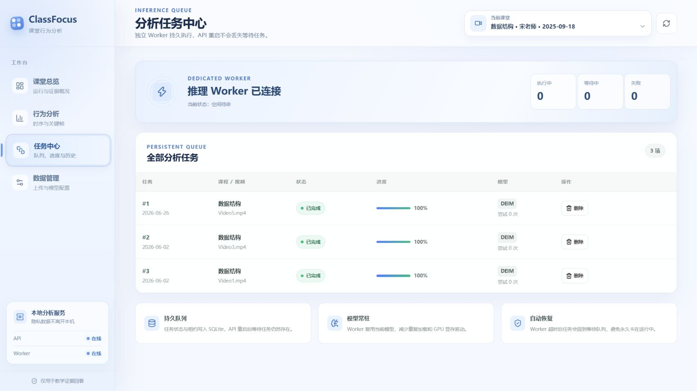
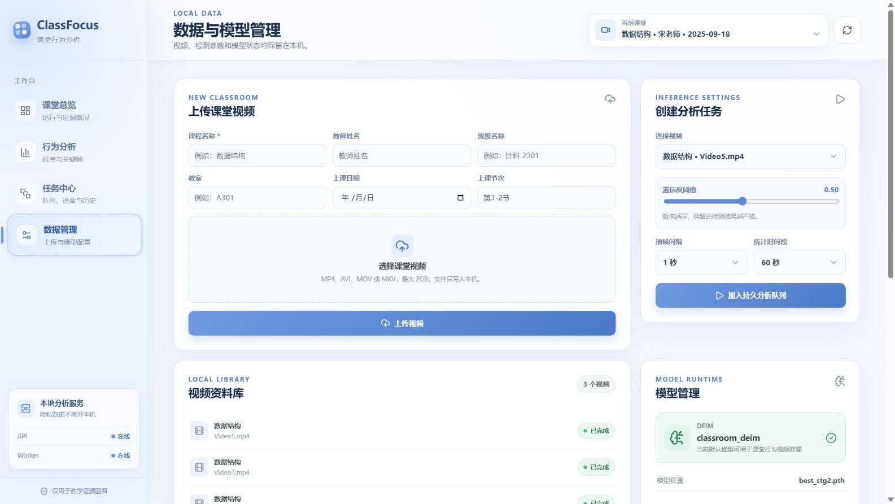
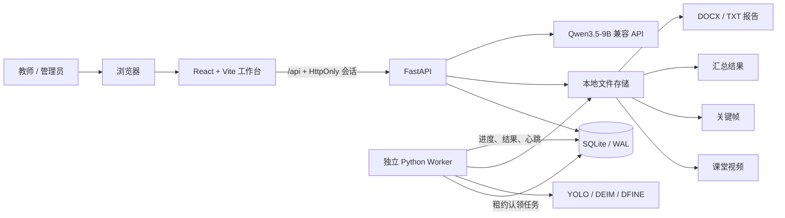
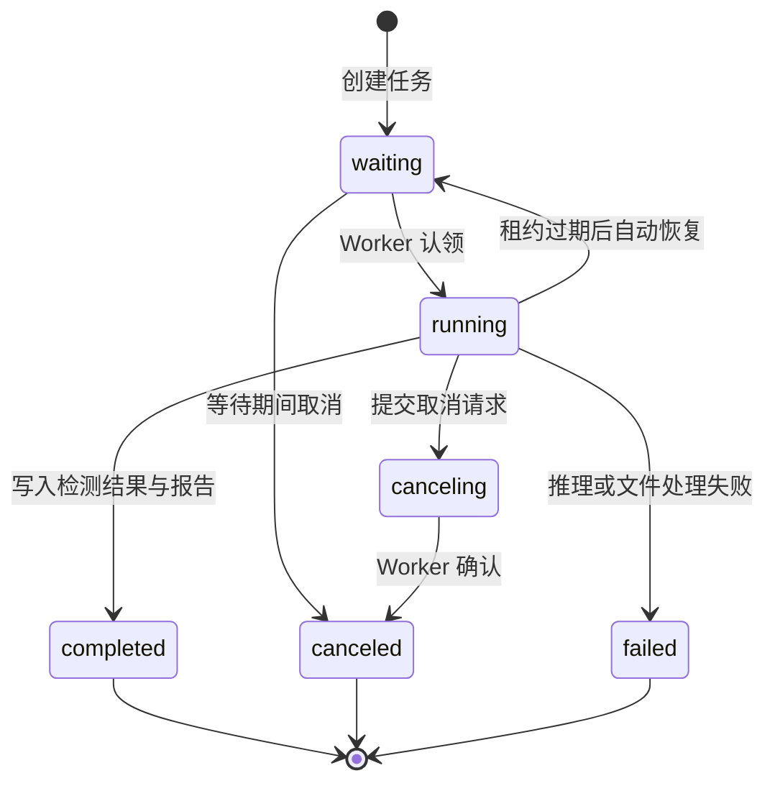
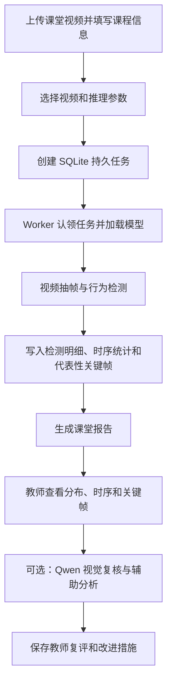

# ClassFocus 课堂行为分析系统

> 本地运行的课堂视频行为证据分析平台  
> React/Vite 工作台 · FastAPI 业务接口 · 独立推理 Worker · SQLite/WAL 持久队列

ClassFocus 面向课堂观察、教学复盘和证据回看场景。系统从课堂视频中提取六类可观察行为，生成时序统计、代表性关键帧、证据质量说明和课堂报告，并支持使用 Qwen3.5-9B 对关键帧遮挡关系及课堂情境进行辅助复核。

系统默认仅监听本机地址，视频、模型、数据库、关键帧和报告都保存在项目所在计算机中。



## 目录

- [系统定位](#系统定位)
- [主要功能](#主要功能)
- [界面预览](#界面预览)
- [系统架构](#系统架构)
- [技术栈](#技术栈)
- [快速开始](#快速开始)
- [运行方式](#运行方式)
- [使用流程](#使用流程)
- [配置说明](#配置说明)
- [模型与大模型](#模型与大模型)
- [持久任务与数据存储](#持久任务与数据存储)
- [API 概览](#api-概览)
- [安全与隐私](#安全与隐私)
- [测试与维护](#测试与维护)
- [常见问题](#常见问题)
- [项目结构](#项目结构)

## 系统定位

ClassFocus 识别的是视频中能够被观察和回看的外显行为，而不是学生的内在认知状态。

| 行为类别 | 系统标签 | 使用说明 |
| --- | --- | --- |
| 听课 | `listening` | 表示面向课堂内容的可观察姿态，不等同于认知投入程度 |
| 书写 | `writing` | 可能是笔记、练习或其他书写活动，需要结合课堂任务解释 |
| 阅读 | `reading` | 可能是阅读教材、资料或其他内容，需要结合上下文复核 |
| 使用手机 | `using phone` | 可能用于扫码答题或资料查询，也可能与教学无关 |
| 低头 | `bowing the head` | 可能对应书写、阅读、查看材料、疲劳或姿态误检 |
| 睡觉 | `sleeping` | 应结合持续时间、遮挡关系和关键帧进行人工确认 |

系统输出只用于：

- 筛选值得回看的课堂时间段；
- 汇总课堂行为构成和时序变化；
- 提供可追溯的视频帧与检测证据；
- 辅助教师完成课堂复盘和改进记录。

系统不应用于：

- 测量学生的内在专注、理解或学习质量；
- 对学生进行个体排名、标签化评价；
- 直接产生惩罚性、纪律性或高风险自动决策。

最终解释应由教师结合教学环节、课堂任务、学生差异和原始视频完成。

## 主要功能

### 1. 课堂分析总览

- 当前课堂、视频、任务、报告和待复核片段统计；
- FastAPI、Worker、SQLite/WAL 和当前模型运行状态；
- 课堂证据完整度、主要行为、复核线索和视频时长；
- 历史课堂行为构成和跨课堂趋势；
- 课堂选择、手动刷新和任务状态自动更新。

### 2. 课堂行为分析

- 六类行为数量、占比和彩色分布；
- 按时间段汇总的行为证据与复核提示；
- 证据类别覆盖、时序覆盖、片段可追溯性等质量维度；
- 代表性关键帧、检测框、目标置信度和目标明细；
- 关键帧 S-S / S-O 遮挡关系视觉复核；
- 教师改进措施、责任人、期限、状态、结论和课堂情境记录；
- 当前课堂报告导出与下载。

### 3. 持久任务中心

- 独立 Worker 负责模型加载和视频推理；
- SQLite 持久保存等待、运行、完成、失败和取消状态；
- API 重启不会丢失等待任务；
- Worker 心跳、任务租约和超时自动恢复；
- 进度、模型、尝试次数和错误信息可追踪；
- 支持安全取消和删除已结束任务。

### 4. 数据与模型管理

- 上传 MP4、AVI、MOV、MKV 课堂视频；
- 保存课程、教师、班级、教室、日期和节次信息；
- 配置置信度阈值、抽帧间隔和统计时间段；
- 上传并切换 `.pt` / `.pth` 模型权重；
- 上传并切换 `.yml` / `.yaml` 检测配置；
- 检查 OpenCV、Ultralytics、DEIM/DFINE 运行依赖；
- 在本地视频资料库中创建新的分析任务。

### 5. Qwen 辅助复核

- 文本辅助分析：行为证据汇总、情境一致性分析、教学反思建议；
- 视觉复核：检查关键帧目标遮挡、目标编号和可见性；
- 分批处理较多目标，降低单次视觉请求负载；
- 对限流、连接超时、格式缺失和不完整返回进行重试；
- 模型不可用时保留本地规则证据，不影响基础分析和报告查看。

## 界面预览

### 课堂行为分析

行为分布、复核提示和证据质量集中展示，避免用单一比例直接解释课堂状态。



### 分析任务中心

任务状态由 SQLite 持久化，Worker 与 API 解耦，服务重启后仍可继续处理等待任务。



### 数据与模型管理

视频上传、任务参数、资料库和模型状态在同一页面完成管理。



## 系统架构



### 组件职责

| 组件 | 主要职责 |
| --- | --- |
| React/Vite | 课堂总览、分析、关键帧、任务和数据管理界面 |
| FastAPI | 会话保护、视频与任务接口、统计、关键帧、报告和大模型请求 |
| Worker | 长时间运行的视频解码、模型推理、进度上报和报告生成 |
| SQLite/WAL | 课堂、视频、任务、检测结果、Worker 心跳和教师复评记录 |
| 本地文件目录 | 原始视频、代表性关键帧、汇总 JSON、报告和模型权重 |
| Qwen API | 文本诊断和视觉遮挡复核；不可用时不阻塞本地推理结果 |

### 分析任务生命周期



## 技术栈

| 层级 | 技术 |
| --- | --- |
| 前端 | React 19、TypeScript、Vite、Lucide Icons |
| API | FastAPI、Uvicorn、Pydantic |
| Worker | Python、OpenCV、PyTorch、TorchVision |
| 检测模型 | Ultralytics YOLO、DEIM、DFINE |
| 数据库 | SQLite，WAL 日志模式 |
| 报告 | python-docx，缺少依赖时回退为文本报告 |
| 大模型 | OpenAI 兼容 Chat Completions 接口、Qwen3.5-9B |
| 测试 | unittest、FastAPI TestClient、TypeScript 类型检查、Vite 生产构建 |

当前项目已在以下本地环境完成验证：

- Python 3.10；
- Node.js 24；
- Windows 10/11；
- Vite 要求 Node.js `^20.19.0` 或 `>=22.12.0`。

## 快速开始

### 1. 准备环境

建议准备：

- Python 3.10；
- Node.js `^20.19.0` 或 `>=22.12.0`；
- 充足的本地磁盘空间；
- 可选的 NVIDIA GPU 与适配当前 PyTorch 的驱动；
- YOLO `.pt` 权重，或 DEIM/DFINE `.pth` 权重、配置与外部工程。

进入项目根目录：

```powershell
cd C:\path\to\website
```

### 2. 创建 Python 虚拟环境

```powershell
python -m venv .venv
.\.venv\Scripts\Activate.ps1
python -m pip install --upgrade pip
python -m pip install -r requirements.txt
```

如果 PowerShell 禁止执行激活脚本，可在当前用户范围调整策略，或直接使用 `.venv\Scripts\python.exe` 执行后续命令。

### 3. 安装前端依赖

```powershell
cd frontend
npm ci
cd ..
```

### 4. 创建本地环境配置

```powershell
Copy-Item .env.example .env
```

至少检查以下字段：

```dotenv
LLM_API_KEY=your-key
LLM_BASE_URL=https://api.siliconflow.cn/v1
LLM_MODEL=Qwen/Qwen3.5-9B

VISION_API_KEY=your-key
VISION_BASE_URL=https://api.siliconflow.cn/v1
VISION_MODEL=Qwen/Qwen3.5-9B

DEIM_REPO_PATH=C:/path/to/deim
```

不使用大模型时可以暂不配置密钥，本地视频推理、统计、关键帧和规则证据仍可使用。

### 5. 初始化数据库并构建前端

```powershell
python scripts\init_db.py
cd frontend
npm run build
cd ..
```

### 6. 一键启动

```powershell
powershell -ExecutionPolicy Bypass -File scripts\start_local.ps1
```

启动脚本会：

1. 检查 `frontend/dist`，缺失时自动安装依赖并构建；
2. 启动 FastAPI；
3. 启动独立 Worker；
4. 等待 API 与 Worker 健康检查；
5. 输出工作台地址和进程编号。

访问地址：

| 服务 | 地址 |
| --- | --- |
| ClassFocus 工作台 | [http://127.0.0.1:8000](http://127.0.0.1:8000) |
| 健康检查 | [http://127.0.0.1:8000/api/health](http://127.0.0.1:8000/api/health) |
| Swagger API 文档 | [http://127.0.0.1:8000/docs](http://127.0.0.1:8000/docs) |
| ReDoc | [http://127.0.0.1:8000/redoc](http://127.0.0.1:8000/redoc) |

## 运行方式

### 本地生产模式

使用一键启动脚本时，FastAPI 在 `127.0.0.1:8000` 提供 API，并直接托管 `frontend/dist`。

```text
http://127.0.0.1:8000/
├── React 单页应用
├── /assets/*
├── /api/*
├── /docs
└── /redoc
```

### 手动开发模式

分别打开三个终端。

终端一：FastAPI 开发服务

```powershell
.\.venv\Scripts\Activate.ps1
python scripts\run_api.py
```

终端二：独立推理 Worker

```powershell
.\.venv\Scripts\Activate.ps1
python scripts\run_worker.py
```

终端三：React 热更新服务

```powershell
cd frontend
npm run dev
```

开发页面位于 [http://127.0.0.1:5173](http://127.0.0.1:5173)。Vite 会将 `/api` 请求代理到 `http://127.0.0.1:8000`。

## 使用流程



### 推荐操作顺序

1. 在“数据管理”上传视频并填写课堂元数据；
2. 选择视频、置信度、抽帧间隔和统计时间段；
3. 将任务加入持久队列；
4. 在“任务中心”观察等待、运行和完成状态；
5. 在“行为分析”查看分布、时序证据和关键帧；
6. 对重点帧执行视觉复核，或生成情境化辅助分析；
7. 填写教师复评与改进记录；
8. 下载课堂分析报告。

## 配置说明

配置分为两个部分：

- `.env`：密钥、外部服务、超时、重试和本地访问保护；
- `configs/config.yaml`：端口、存储目录、模型、抽帧和行为类别。

### 大模型环境变量

| 变量 | 默认示例 | 说明 |
| --- | --- | --- |
| `LLM_API_KEY` | 空 | 文本辅助分析密钥 |
| `LLM_BASE_URL` | SiliconFlow `/v1` | OpenAI 兼容接口根地址 |
| `LLM_MODEL` | `Qwen/Qwen3.5-9B` | 文本主模型 |
| `LLM_FALLBACK_MODEL` | 空 | 当前默认不启用后备模型 |
| `LLM_TIMEOUT_SECONDS` | `150` | 单次文本请求超时 |
| `LLM_RETRY_ATTEMPTS` | `2` | 连接、限流或服务异常重试次数 |
| `LLM_ENABLE_THINKING` | `false` | 是否请求思考模式 |
| `LLM_FORMAT_RETRY_ATTEMPTS` | `2` | 返回结构不完整时的修复重试 |
| `VISION_API_KEY` | 空 | 视觉复核密钥 |
| `VISION_BASE_URL` | SiliconFlow `/v1` | 视觉接口根地址 |
| `VISION_MODEL` | `Qwen/Qwen3.5-9B` | 视觉主模型 |
| `VISION_FALLBACK_MODEL` | 空 | 当前默认不启用后备模型 |
| `VISION_TIMEOUT_SECONDS` | `110` | 单批视觉请求超时 |
| `VISION_BATCH_SIZE` | `6` | 每批目标数量；较小批次会生成更大的目标局部图，有利于识别轻微遮挡 |
| `VISION_FORMAT_RETRY_ATTEMPTS` | `2` | 视觉结果编号或结构不完整时的重试 |
| `VISION_OCCLUSION_MIN_CONFIDENCE` | `0.35` | 保留 S-S/S-O 判定的最低置信度；调低会提高轻度真实遮挡的召回率 |

### 本地服务变量

| 变量 | 说明 |
| --- | --- |
| `CLASSFOCUS_API_TOKEN` | 可选固定本地令牌；留空时自动生成 `.classfocus-token` |
| `CLASSFOCUS_ALLOWED_ORIGINS` | 允许建立本地会话的 React 来源 |
| `DEIM_REPO_PATH` | 外部 DEIM/DFINE 工程目录，需要包含运行所需的 `engine/core` |

### 系统配置

`configs/config.yaml` 的关键字段：

```yaml
server:
  host: 127.0.0.1
  port: 8000

database:
  path: classroom_behavior.db

model:
  name: classroom_deim
  path: models/best_stg2.pth
  config_path: configs/detection/scb/deim_MSCF_s_oc3500.yml
  repo_path: vendor/deim
  confidence_threshold: 0.5
  iou_threshold: 0.45
  device: auto

analysis:
  frame_sample_seconds: 1
  segment_seconds: 60
  save_key_frames: true
  max_key_frames: 24
```

路径可以使用相对项目根目录的写法。个人计算机上的绝对路径建议放在 `.env`，不要写入公共配置或提交到版本库。

## 模型与大模型

### YOLO 模型

- 权重扩展名：`.pt`；
- 运行依赖：Ultralytics、PyTorch、OpenCV；
- 适合使用 Ultralytics 兼容权重直接推理；
- 可通过“数据管理 → 模型管理”上传并设为当前模型。

### DEIM / DFINE 模型

- 权重扩展名：`.pth`；
- 需要匹配的 `.yml` / `.yaml` 检测配置；
- 需要外部 DEIM/DFINE 工程及其 `engine/core`；
- 通过 `DEIM_REPO_PATH` 指向实际工程；
- 后台模型状态会检查权重、配置、工程目录和 Python 依赖。

### Qwen3.5-9B

文本辅助分析和视觉复核默认使用同一个模型名称，但拥有独立的密钥、超时和批量参数。

调用大模型前请确认：

1. 服务商确实提供配置的模型 ID；
2. 视觉复核所用模型和接口支持图片输入；
3. `BASE_URL` 以 OpenAI 兼容 `/v1` 根地址结束；
4. 本机能够访问服务商域名；
5. API 密钥有可用额度且未触发并发或频率限制。

ClassFocus 不会把密钥返回给前端；状态接口只返回是否已配置、模型名称和可用性说明。

## 持久任务与数据存储

### SQLite/WAL

`classroom_behavior.db` 是系统数据事实来源，数据库启用 WAL 模式以改善 API 读取与 Worker 写入并发。

数据库保存：

- 课程和视频元数据；
- 任务状态、进度、取消标记、租约和错误信息；
- 行为检测明细；
- 时序统计和报告索引；
- Worker 心跳；
- 教师复评、改进措施和结论。

请不要在 API 或 Worker 运行期间用会独占锁的工具修改数据库。

### Worker 机制

- Worker 从 SQLite 中原子认领等待任务；
- 运行期间更新心跳、租约和任务进度；
- API 只负责创建任务，不直接执行耗时推理；
- API 重启不会中断 Worker 当前任务；
- Worker 异常退出后，过期租约会被后续 Worker 恢复；
- 单 Worker 缓存当前模型，减少重复加载和 GPU 显存波动。

### 文件存储

```text
uploads/
├── videos/      原始课堂视频
├── frames/      代表性关键帧
├── results/     汇总 JSON
└── reports/     DOCX 或 TXT 报告

models/
├── *.pt         YOLO 权重
└── *.pth        DEIM / DFINE 权重
```

检测明细以 SQLite 为准，JSON 结果只保留紧凑汇总。系统默认最多长期保留每个任务 24 张代表性关键帧，其他画面可在需要时从原视频重建。

## API 概览

完整、可交互的接口定义以 [http://127.0.0.1:8000/docs](http://127.0.0.1:8000/docs) 为准。

| 方法 | 路径 | 用途 |
| --- | --- | --- |
| POST | `/api/session` | 为允许的本地前端建立 HttpOnly 会话 |
| GET | `/api/health` | API 与 Worker 健康状态 |
| POST | `/api/videos/upload` | 上传课堂视频和元数据 |
| GET | `/api/videos` | 视频资料库 |
| GET | `/api/tasks/dashboard` | 工作台聚合数据 |
| GET | `/api/tasks/events` | 任务状态 SSE 更新 |
| POST | `/api/tasks/analyze` | 创建持久分析任务 |
| POST | `/api/tasks/{task_id}/cancel` | 请求取消任务 |
| DELETE | `/api/tasks/{task_id}` | 删除允许删除的任务及关联结果 |
| GET | `/api/tasks/{task_id}/frames` | 关键帧和目标信息 |
| POST | `/api/tasks/{task_id}/frames/{frame_id}/occlusion` | 关键帧视觉复核 |
| GET/POST | `/api/tasks/{task_id}/review` | 读取或保存教师复评 |
| GET | `/api/reports/{task_id}/download` | 下载课堂报告 |
| GET | `/api/agent/status` | 大模型配置状态 |
| POST | `/api/agent/generate` | 生成课堂辅助分析 |
| GET | `/api/models/current` | 当前模型及运行依赖 |
| POST | `/api/models/upload` | 上传模型权重 |
| POST | `/api/models/config` | 上传检测配置 |

除公共健康检查和会话入口外，`/api/*` 请求需要本地会话 Cookie 或 `X-ClassFocus-Token`。

## 安全与隐私

### 默认保护

- FastAPI 默认只监听 `127.0.0.1`；
- CORS 仅允许配置的本地 React 地址；
- 首次启动自动生成随机 `.classfocus-token`；
- 浏览器使用 `HttpOnly`、`SameSite=Strict` 本地会话 Cookie；
- `.env`、令牌、数据库、模型、上传视频和分析结果默认被 Git 忽略；
- 文件接口校验任务与文件归属，避免直接读取任意本地路径；
- 上传接口限制扩展名、字段和请求范围。

### 大模型数据边界

本地推理、统计和报告不要求外部大模型。只有主动执行以下操作时，相关数据才会发送到配置的大模型服务：

- 生成课堂辅助分析；
- 执行关键帧视觉遮挡复核。

部署前请根据所在学校或组织的制度确认：

- 是否允许课堂图像发送到第三方模型服务；
- 服务商的数据保留和隐私政策；
- 是否需要告知、同意、脱敏或私有化部署；
- API 密钥和账单权限的管理方式。

如需提供局域网或公网访问，不应只修改监听地址；还应增加 HTTPS、身份认证、权限控制、审计、密钥托管、备份和访问隔离。

## 测试与维护

### 后端测试

```powershell
.\.venv\Scripts\python.exe -m unittest discover -s tests -v
```

测试覆盖：

- 本地会话、令牌和 CORS；
- 视频上传与参数边界；
- SQLite/WAL 与持久队列；
- Worker 认领、取消和租约恢复；
- 任务删除保护；
- 统计证据边界；
- 关键帧访问和视觉复核；
- 大模型超时、限流和不完整返回重试；
- 模型和检测配置上传；
- 教师复评持久化。

### 前端检查与生产构建

```powershell
cd frontend
npm run build
```

构建命令会执行：

1. React/TypeScript 类型检查；
2. Vite 配置类型检查；
3. 生产资源打包。

### Python 语法检查

```powershell
python -m compileall -q app_api app_worker scripts tests
```

### 存储维护

```powershell
python scripts\maintain_storage.py
```

自定义每个任务保留的关键帧数：

```powershell
python scripts\maintain_storage.py --keep-frames 12
```

维护脚本会压缩旧汇总结果并清理多余关键帧，不删除原始视频或数据库任务记录。

### 建议备份

停止 API 和 Worker 后，至少备份：

- `classroom_behavior.db`；
- `uploads/videos`；
- `uploads/reports`；
- `models`；
- `configs`；
- 本机保存的 `.env`。

## 常见问题

### 1. 页面打不开

检查：

```powershell
Invoke-RestMethod http://127.0.0.1:8000/api/health
```

如果 API 未启动，运行：

```powershell
python scripts\run_api.py
```

如果 API 正常但页面仍是旧版本，重新执行 `npm run build`，然后强制刷新浏览器缓存。

### 2. Worker 显示离线

单独启动：

```powershell
python scripts\run_worker.py
```

并检查：

- 是否使用了安装依赖的虚拟环境；
- 数据库文件是否可写；
- 模型权重和配置是否存在；
- 是否有另一个 Worker 正在占用 GPU；
- 控制台是否报告模型导入或显存错误。

### 3. DEIM/DFINE 模型不可用

确认：

- `DEIM_REPO_PATH` 指向正确工程；
- 工程包含运行需要的 `engine/core`；
- `.pth` 权重与配置匹配；
- `configs/config.yaml` 中的 `config_path` 有效；
- 模型管理页未报告缺失 Python 模块。

### 4. 视觉复核或辅助分析超时

依次检查：

1. `API_KEY`、`BASE_URL` 和模型名称；
2. 服务商模型是否支持当前请求类型；
3. 本机网络和代理是否允许访问服务商；
4. 账户余额、速率限制和并发限制；
5. 视觉批量是否过大；
6. 超时和重试参数是否适合当前服务延迟。

可适当调整：

```dotenv
LLM_TIMEOUT_SECONDS=180
LLM_RETRY_ATTEMPTS=3
VISION_TIMEOUT_SECONDS=150
VISION_BATCH_SIZE=8
LLM_FORMAT_RETRY_ATTEMPTS=2
VISION_FORMAT_RETRY_ATTEMPTS=2
```

不要通过无限增加超时掩盖无效模型名、错误接口地址或不支持图片输入的问题。

### 5. 数据库提示忙或锁定

- 确保项目目录和数据库可写；
- 避免使用外部工具在运行期间独占数据库；
- 不要同时启动多个执行相同任务的非受控脚本；
- 正常退出并重新启动 API/Worker；
- 不要直接删除 `-wal` 或 `-shm` 文件。

### 6. 视频上传失败

确认视频：

- 扩展名为 MP4、AVI、MOV 或 MKV；
- 大小不超过界面标明的 2GB 限制；
- 文件未被其他程序独占；
- 课程名称等必填字段完整；
- OpenCV 能够读取其编码格式。

## 项目结构

```text
website/
├── app_api/
│   ├── core/             配置、环境变量和本地安全
│   ├── db/               SQLite 初始化与 CRUD
│   ├── routers/          视频、任务、报告、模型和 Agent 接口
│   ├── schemas/          API 请求模型
│   ├── services/         推理、统计、关键帧、报告和大模型服务
│   └── main.py           FastAPI 入口与 React 静态资源托管
├── app_worker/
│   └── main.py           持久推理 Worker、心跳与任务租约
├── configs/
│   ├── config.yaml       系统主配置
│   └── detection/        DEIM/DFINE 检测配置
├── docs/
│   ├── images/           README 界面截图
│   └── upgrade-parity.md 升级功能对照与回归基线
├── frontend/
│   ├── public/           公共静态资源
│   ├── src/              React、API 客户端、类型与样式
│   ├── dist/             Vite 生产构建
│   ├── package.json
│   └── vite.config.ts
├── models/               本地模型权重
├── scripts/
│   ├── init_db.py        初始化 SQLite
│   ├── maintain_storage.py
│   ├── run_api.py
│   ├── run_worker.py
│   └── start_local.ps1   Windows 一键启动
├── tests/
│   └── test_api_validation.py
├── uploads/
│   ├── videos/
│   ├── frames/
│   ├── results/
│   └── reports/
├── .env.example
├── requirements.txt
└── classroom_behavior.db 本地运行后生成
```

## 进一步阅读

- [升级功能对照与回归基线](docs/upgrade-parity.md)
- 启动服务后的 [Swagger API 文档](http://127.0.0.1:8000/docs)

---

ClassFocus 的核心原则是：保留可回看的课堂证据，明确自动分析边界，把最终解释权交给教师。
